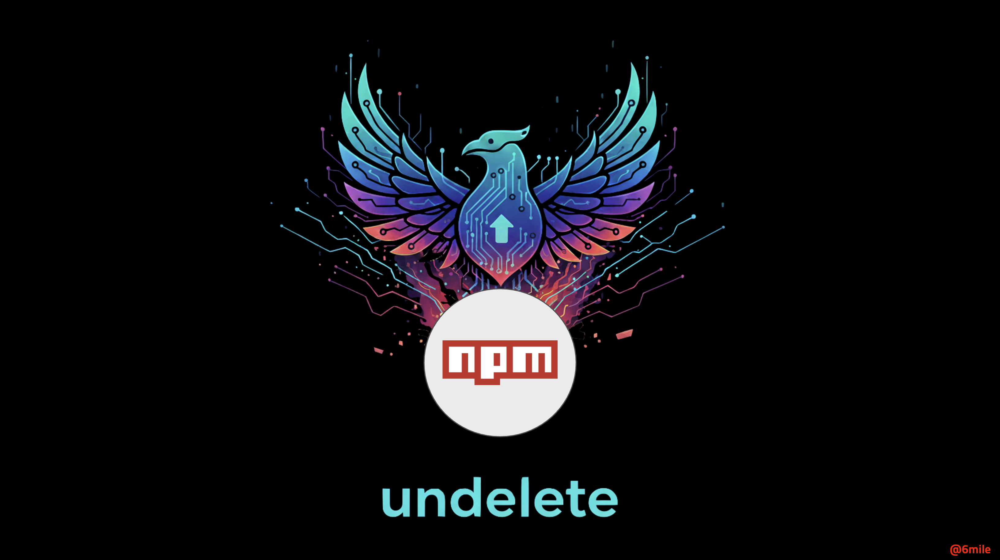

# undelete

This package "undeletes" a package that has been deleted from the NPM registry.  How does it do that?
Well, magic of course!  No, no ... on the serious tip, the undelete function works by going to secondary
NPM mirrors and pulling the files from their cache.

## How to install

```bash
npm install undelete
```

## Usage

```bash
undelete <package-name> [options]
```

### Options

- `-n, --number <count>` - Number of versions to download (1-20, default: 5)
- `-p, --path <directory>` - Save packages to specified directory (default: current directory)
- `-d, --data` - Get package metadata (NPM user, email, description) instead of downloading
- `-s, --silent` - Run in silent mode with no output (JSON output when combined with `-d`)
- `-h, --help` - Display help message

### Examples

```bash
# Download 5 most recent versions (default)
undelete express

# Download 10 versions
undelete @angular/core -n 10

# Download to specific directory
undelete lodash --path ./downloads

# Get package metadata
undelete express --data

# Get metadata as JSON (silent mode) # GREAT FOR SCRIPTING
undelete react -d -s

# Combine options
undelete react -p /tmp/packages -n 15 -s
```

## Features

- Downloads 1-20 most recent versions of any package (default: 5)
- Retrieves package metadata including NPM user, email, and maintainers
- Checks 5 registries in order: npmjs.org, cnpmjs.org, npmmirror.com, huaweicloud.com, tencent.com
- Automatic retry (up to 10 attempts for Tencent mirror)
- Skips security placeholder packages (0.0.1-security.tgz)
- Custom output directory support
- Silent mode for automation and JSON output
- No external dependencies

## Requirements

Node.js 12.0.0 or higher

## Output

### Download Mode
Downloaded files are saved as `{package-name}-{version}.tgz` in the specified directory.

### Data Mode
Normal mode displays formatted package information. Silent mode (`-d -s`) outputs JSON:

```json
{
  "package": "express",
  "version": "4.18.2",
  "description": "Fast, unopinionated, minimalist web framework",
  "npmUser": "dougwilson",
  "npmUserEmail": "doug@somethingdoug.com",
  "maintainers": [
    {
      "name": "dougwilson",
      "email": "doug@somethingdoug.com"
    }
  ]
}
```

## Notes

- Tencent mirror may require multiple retry attempts
- Script stops after successfully downloading/retrieving from first available registry
- Security placeholder versions (0.0.1-security.tgz) are automatically skipped
- Security placeholder emails (npm@npmjs.com) are automatically skipped
- Exit code 0 on success, 1 on failure

## License

MIT
